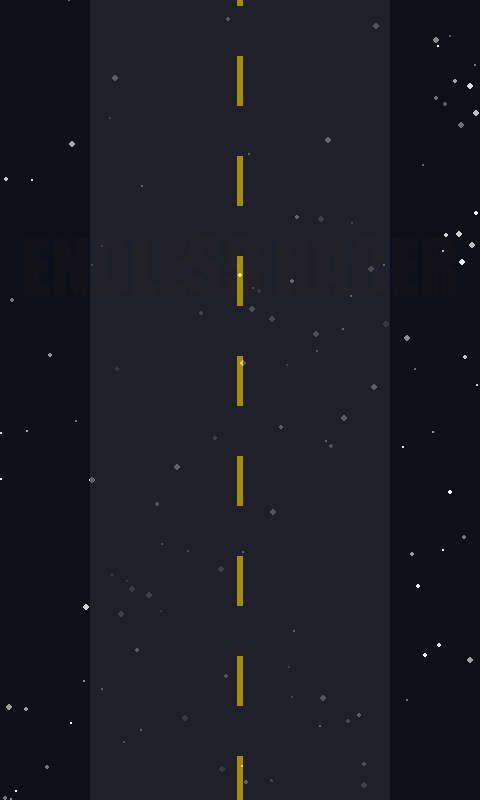
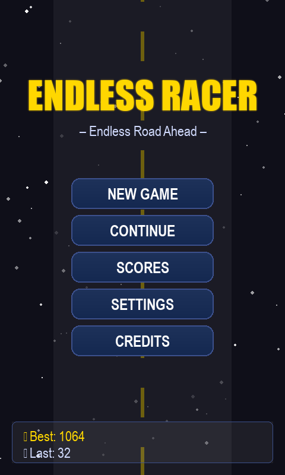
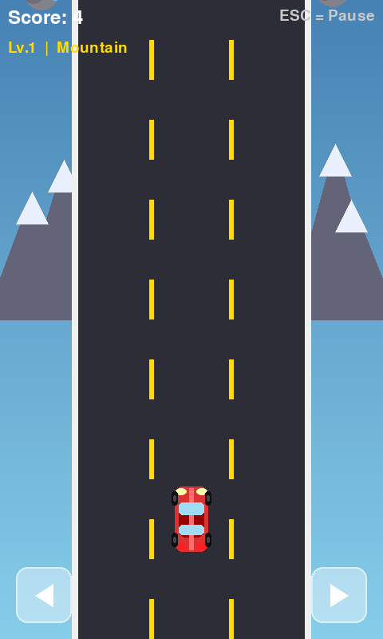
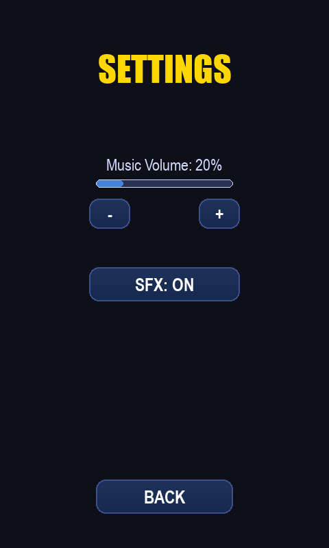
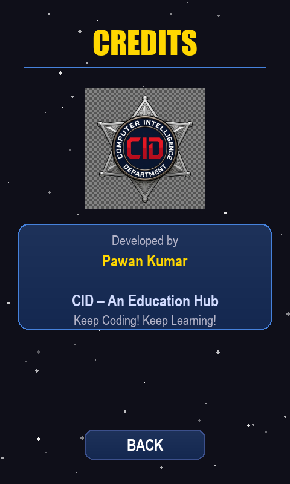

# 🏎️ Endless Racer - Android Game

A stylish, procedural 2D endless car racing game built with **Python** and **Pygame-CE**. Optimized for Android devices with touch controls, dynamic environments, and persistent high scores.

## ✨ Features

- **🌆 Procedural Environments:** Experience changing terrains from Mountains to Jungle, Green Land, and Desert as you score higher.
- **🚗 Smooth Controls:** Optimized on-screen touch controls for mobile play.
- **🔊 Dynamic Audio:** 
  - One-time "Welcome back racer" voice greeting.
  - Adaptive racing music (softer in menus, high energy in game).
  - Saved volume and SFX settings.
- **🏆 Score System:** Persistent "Best Score" and "Previous Score" tracking.
- **🎨 Modern UI:** Smooth gradients, animated transitions, and a custom Credits screen.
- **📱 Android Ready:** Configured for Buildozer with portrait orientation and specific architectures.

## 📸 Screenshots

| Welcome Screen | Main Menu | Gameplay |
|:---:|:---:|:---:|
|  |  |  |

| Settings | Credits |
|:---:|:---:|
|  |  |

## 🛠️ Tech Stack

- **Language:** Python 3.11+
- **Engine:** Pygame-CE (Community Edition)
- **Packaging:** Buildozer (for Android APK)
- **Persistence:** JSON-based local storage

## 🚀 Getting Started

### Prerequisites
- Python 3.x
- pip

### Installation
1. Clone the repository:
   ```bash
   git clone https://github.com/YOUR_USERNAME/Endless-Racer.git
   cd Endless-Racer
   ```
2. Install dependencies:
   ```bash
   pip install -r requirements.txt
   ```
3. Run the game:
   ```bash
   python main.py
   ```

### Building for Android
Use Buildozer in a Linux environment (or WSL):
```bash
buildozer android debug
```

## 📜 Credits

- **Developer:** Pawan Kumar
- **Organization:** CID – An Education Hub
- **Tagline:** Keep Coding! Keep Learning!

---
*Developed with ❤️ by Pawan Kumar*
